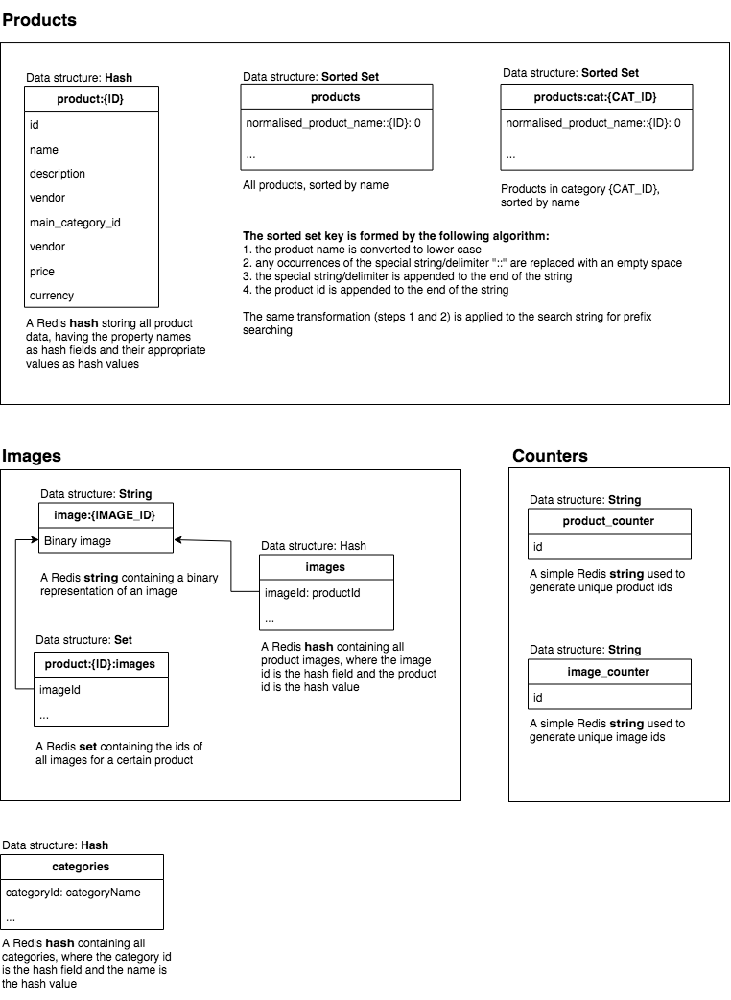

# Redis Product Catalogue Service

## Overview
A simple REST API providing a way to manage and browse products

## Context
This project is done as a simple exercise for data modelling with Redis and Go

## Logical Data Model
Image  
- Id : Number
- Value : Binary
- Product: Product (1)  

Product  
- Id : Number
- Name : String
- Description: String
- Vendor : String
- Price : Number
- Currency : String
- MainCategory : Category (1)
- Images : Image (0..n)

Category
- Id : Number
- Name : String
- Products : Product (0..n)

## Physical Data Model


## Documentation
You can find the documentation at `/documentation`.  

The API is documented with the OpenAPI 3 specification. The `yaml` files are in the `documentation` folder.
To export the documentation to a self-contained, zero-dependencies html file, you can use the [ReDoc library](https://github.com/Redocly/redoc). Just run the following command:  

```redoc-cli bundle documentation/index.yaml --output documentation/index.html```

## Configuration
When setting up rename the `conf_example.json` file to `conf.json` and populate it with your values. 

## Tests